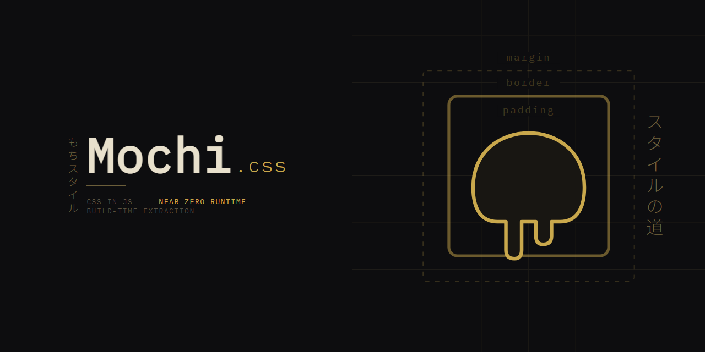

# Near zero-runtime CSS-in-JS solution with build-time style extraction

Mochi.css brings the ergonomics of CSS-in-JS without paying the significant runtime cost.
Styles are statically extracted at build time through a PostCSS plugin,
making your shipped bundle smaller, predictable, and framework-agnostic.

<div align="center">

[](https://www.patreon.com/Niikelion)

</div>

---

## ✨ Features

- **Near zero runtime** – minimal style logic in your final bundle
- **Build-time CSS extraction** – using a PostCSS plugin
- **Style variants** – create variants for your styles with ease
- **Nested selectors** – use sub-selectors in your styles
- **Media queries** – make your styles responsive
- **Great type support** – TypeScript-first DX
- **Minimal restrictions** – define styles anywhere your code allows
- **Tooling agnostic** – works with anything that supports PostCSS
- **CSS splitting** – improve your load times using tree-shaking

---

## 📦 Installation

```bash
npx @mochi-css/tsuki
```

---

## 🚀 Quick Start

After running `tsuki` should have all the plugins installed.

Create `src/globals.css` file and import it in your project.
After that, you can go wild with your styles!

```tsx
import { styled } from "@mochi-css/react";

const Title = styled("h1", {
  fontSize: 32,
  lineHeight: 36,
});

export default function App() {
  return <Title>Hello Mochi</Title>;
}
```

At build time, the PostCSS plugin extracts the styles into a static `.css` file.
No runtime style injection or providers are required.

---

## 📚 Documentation

Detailed documentation about different parts of Mochi.css can be found here:

- [**@mochi-css/vanilla**](packages/vanilla/README.md) - core package that provides styling functions
- [**@mochi-css/config**](packages/config/README.md) - configuration definition; read to learn more about available options
- [**@mochi-css/tsuki**](packages/tsuki/README.md) - installer for Mochi.css
- [**@mochi-css/postcss**](packages/postcss/README.md) - postcss plugin
- [**@mochi-css/next**](packages/next/README.md) - Next.js plugin
- [**@mochi-css/vite**](packages/vite/README.md) - Vite plugin
- [**@mochi-css/builder**](packages/builder/README.md) - utilities for extracting styles from source code and generating CSS from them

---

## 🌱 Project Status

**Early release** – starting with version 3, new features and improvements will be added while preserving code compatibility within the same major version.
This guarantees that package upgrades within the same major version will not break your code, as long as you don't rely on bugs existing in the previous versions.
If you want to upgrade to the next major version, please read release notes and migration guides to ensure a smooth transition.

Starting with version 4, code-mods for upgrading to the next major version will be provided.

Benchmarks and performance comparisons will be released at a later stage.

---

## 🛠 Planned features

| Feature                      | Status         | Notes                                                                                                                                                  |
|------------------------------|----------------|--------------------------------------------------------------------------------------------------------------------------------------------------------|
| **Zero runtime**             | 🚧 In Progress | Replace style object arguments with pre-computed values at build time, eliminating the remaining runtime overhead                                      |
| **Benchmarks**               | 🕒 Queued      | Compare bundle/runtime size with other CSS-in-JS libraries                                                                                             |
| **Mochi.css/mango**          | 🕒 Queued      | Theming library built on top of Mochi.css/vanilla                                                                                                      |
| **Stitches.js adapter**      | 🚧 In Progress | Drop-in replacement for `css`, `styled`, `globalCss` and `createTheme` from Stiches.js that runs on Mochi.css                                          |
| **Partial PandaCSS adapter** | 🕒 Queued      | Drop-in replacement for `styled` and `cva` from PandaCSS. Other features may not be supported due to different architectures of PandaCSS and Mochi.css |
| **Standalone css building**  | 🚧 In Progress | Extract and bundle static styles from a library                                                                                                        |
| **CSS optimization**         | 🕒 Queued      | Perform simple optimizations on the generated code                                                                                                     |
| **Mochi.css/bento**          | 🕒 Queued      | Layouting library providing primitives for shaping your ui                                                                                             |
| **Blog example app**         | 🕒 Queued      | My(Niikelion) personal blog built with Mochi.css provided as an example of a small, functional app                                                     |
| **Japanese learning app**    | 🕒 Queued      | Example japanese learning website. Content will not be included in the source code                                                                     |

Status legend

🚧 In Progress – actively being worked on
🕒 Queued – planned, not yet in development

---

## 🤝 Contributing

Contributions, feedback, and ideas are welcome!
Please open issues and PRs to help shape Mochi.css.

You can also support me on [my Patreon](https://www.patreon.com/Niikelion).

---

## 📄 License

[MIT](LICENSE.md)
